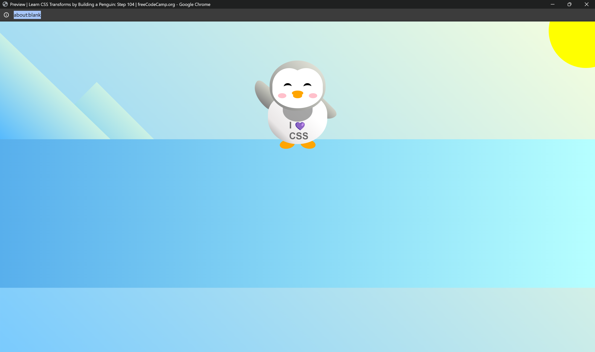

**Happy Flappy Penguin**

**Description:**

"Happy Flappy Penguin" is a delightful project developed in collaboration with Free Code Camp, aimed at learning HTML and CSS transforms while creating an animated penguin character. This project serves as an excellent introduction to web design and animation techniques, allowing you to explore the use of transforms to position, resize, and animate elements.

**Features:**

- Create an adorable penguin character using HTML and CSS transforms.
- Position and resize elements to craft appealing visuals.
- Implement background designs to enhance the overall presentation.
- Animate the penguin character to bring it to life.

**Preview:**

**Usage:**

To explore and customize the Happy Flappy Penguin project:

1. Clone the repository to your local machine using the command git clone https://github.com/Yashi-Singh-1/Happy-Flappy-Penguin.git.
2. Open the index.html file in your preferred web browser to experience the project.
3. Delve into the project files (index.html, styles.css) to modify the penguin character, background designs, and animations according to your creative vision.
4. Experiment with different HTML structures, CSS styles, and animation techniques to enhance your understanding of web design and animation principles.
5. Share your creations with the online community by submitting pull requests, posting on social media, or showcasing your work on personal portfolios or blogs.

**Usage:**

To explore and modify the project, simply clone the repository to your local machine. Open the index.html file in your preferred web browser to view the Happy Flappy Penguin in action. Feel free to experiment with the HTML and CSS files to customize the penguin character and its animations according to your preferences.

**Credits:**

This project was developed in collaboration with Free Code Camp, utilizing their resources and guidance to create an engaging learning experience for web design enthusiasts.